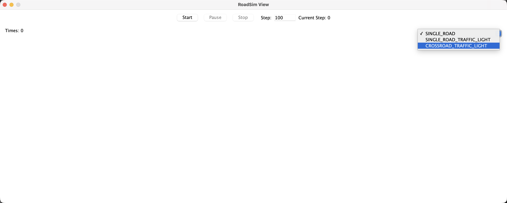
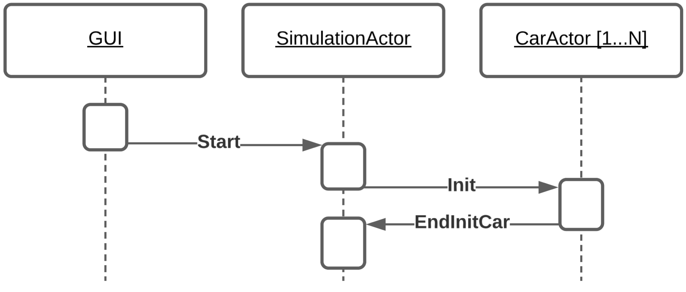
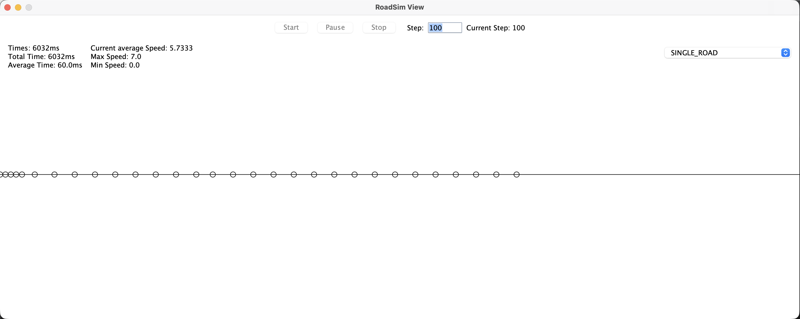
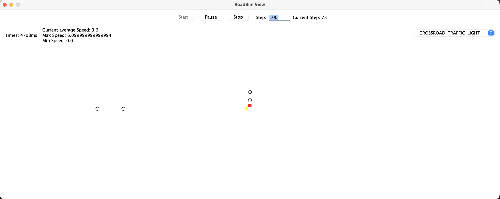
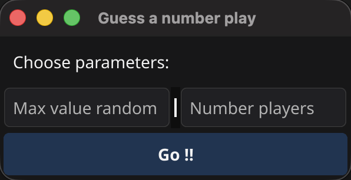
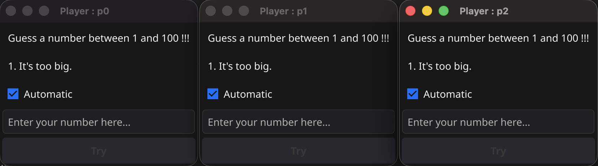

# Relazione PCD-Assignment-3

**Studente:** Manuel Buizo
**Corso:** Programmazione Concorrente e Distribuita
**Anno Accademico:** 2023/2024

---

## Indice

1. [Introduzione](#introduzione)
2. [Progetto 1 – Cars Simulation](#progetto-1--Cars-Simulation)
3. [Progetto 2 – Sudoku MOM](#progetto-2--Sudoku-MOM)
4. [Progetto 3 – Sudoku Java-RMI](#progetto-3--Java-RMI)
5. [Progetto 4 – Guess The Number](#progetto-4--Guess-The-Number)
6. [Conclusioni](#conclusioni)
7. [Riferimenti](#riferimenti)

---

## Introduzione

La presente relazione descrive quattro progetti sviluppati nell’ambito dell’esame di **[Programmazione Concorrente e Distribuita]**.
Ciascun progetto è stato sviluppato con l’obiettivo di analizzare un problema specifico e progettare una soluzione software appropriata, sfruttando le tecnologie trattate durante le lezioni.

Breve panoramica dei progetti:

1. **[Cars Simulation]** – Simulazione multi-agente di automobili basata sul paradigma ad attori con Akka.
2. **[Sudoku MOM]** – Implementazione distribuita di Sudoku tramite Message-Oriented Middleware (MOM) e scambio asincrono di messaggi.
3. **[Sudoku Java-RMI]** – Sviluppo di Sudoku con Distributed Object Computing e comunicazione remota tramite Java RMI.
4. **[Guess The Number]** – Gioco Guess the Number basato su scambio sincrono di messaggi, implementato in Go.

---

## Progetto 1 – Cars Simulation
<div style="display: flex; justify-content: center;">
    
</div>

### Analisi del problema

Partendo dall’[Assignment 1](https://docs.google.com/document/d/1EquRh7I1WYgHInFG3bGTjUEgTNOmRSWT1H_kw4QwqZ0/edit?tab=t.0) relativo alla simulazione delle macchine, il progetto estende la gestione del sistema adottando il paradigma ad attori tramite il framework Akka in Scala. In tale modello, ogni automobile è rappresentata da un attore autonomo, responsabile della gestione del proprio stato, del comportamento e delle interazioni con l’ambiente e con gli altri attori. La simulazione complessiva è coordinata attraverso la comunicazione asincrona tra attori, consentendo una gestione concorrente e scalabile del sistema.

### Punti critici:

- Gestione del muro per la sincronizzazione e il coordinamento delle automobili durante la simulazione.
- Gestione degli step temporali e dello stato di ciascuna automobile a ogni iterazione, mediante l’utilizzo di attori Akka.
- Gestione della comunicazione tramite messaggi per l’integrazione e l’interazione con l’interfaccia grafica (GUI).

### Architettura proposta

La simulazione è implementata utilizzando il framework Akka, che consente di modellare il sistema secondo il paradigma actor-based. Tale approccio facilita la gestione concorrente e distribuita dei processi, permettendo di rappresentare in modo naturale gli elementi della simulazione come attori indipendenti che comunicano tramite scambio di messaggi.

<div style="display: flex; align-items: center; gap: 5%;  flex-direction: row-reverse; margin-bottom: 3%;">
  
   <div style="width: 70%;">
    L’architettura si basa su un attore principale che funge da orchestratore e gestisce un insieme di attori,
    ciascuno dei quali rappresenta un’automobile. L’attore principale è responsabile dell’avanzamento temporale della
    simulazione, che procede a passi discreti di durata Δt. È inoltre possibile abilitare una temporizzazione basata sul
    tempo reale (analoga al frame rate nei videogiochi) per mantenere una sincronizzazione costante durante l’esecuzione.
  </div>
</div>

<div style="display: flex; align-items: center; gap: 5%;  margin-bottom: 3%;">
  
  <div style="width: 55%;">
    Prima dell’avvio della simulazione, viene eseguita una fase di setup iniziale, durante la quale l’attore principale
    coordina l’inizializzazione dei dati e delle condizioni di partenza di ciascun attore automobile.
  </div>
</div>

<div style="display: flex; align-items: center; gap: 5%; flex-direction: row-reverse; margin-bottom: 3%;">
  
  <div style="width: 55%;">
    Ogni automobile è modellata come un attore autonomo, incaricato di gestire il proprio stato interno ed eseguire le tre
    fasi del proprio comportamento: sense, decide e act. Durante ciascun passo di simulazione, le automobili eseguono queste
    fasi in modo concorrente, e quindi non deterministico rispetto all’ordine con cui gli attori vengono schedulati. Al
    termine della propria esecuzione, ogni attore automobile invia un messaggio di completamento all’attore principale.
    In questo modo, per ogni step della simulazione, l’attore principale attende che tutte le automobili abbiano completato
    la propria azione e aggiornato il rispettivo stato prima di procedere con lo step successivo.
  </div>
</div>

<div style="display: flex; align-items: center; gap: 5%; margin-bottom: 3%;">
  
  <div style="width: 55%;">
    Infine, l’attore della simulazione riceve anche messaggi provenienti dalla GUI, che consentono all’utente di interagire
    con l’esecuzione. In particolare, la GUI fornisce controlli per gestire gli stati della simulazione — come start, pause,
    resume e stop — oltre a un campo di testo (text field) che permette di specificare il numero totale di step che la
    simulazione deve eseguire. Queste interazioni vengono gestite attraverso messaggi inviati all’attore principale, che
    aggiorna di conseguenza il flusso di esecuzione.
  </div>
</div>

### Tecnologie utilizzate


| Componente | Tecnologia        | Ruolo              |
|------------|-------------------|--------------------|
| Frontend   | Java.Swing        | Interfaccia utente |
| Backend    | Java + Scala.Akka | Logica applicativa |

### Sviluppo

È stata sviluppata una classe `Engine` dedicata alla gestione del tempo e degli step della simulazione. Essa consente inoltre di calcolare diverse statistiche temporali, come il tempo trascorso, la durata complessiva della simulazione, e include funzionalità per la gestione della pausa e la sincronizzazione temporale tramite il calcolo del delay. La struttura dell’Engine è stata realizzata interamente secondo il paradigma funzionale.

```scala
    trait Engine extends Scheduler, Stepper:
      val startTime: Long
      val endTime: Long
      val allTimeSpent: Long
      val isInPause: Boolean
  
      override def start(): Engine
      def pause(): Engine
      def resume(): Engine
      override def stop(): Engine
      override def nextStep(): Engine
      override def setTotalSteps(value: Int): Engine
      def averageTimeForStep(): Double
      def timeElapsedSinceStart(): Long
```

`SimulationActor` è l’attore della simulazione. Per la sua implementazione è stato utilizzato il framework Akka insieme al linguaggio Scala. Sono stati definiti i messaggi attraverso cui è possibile interagire con la simulazione, inclusi i messaggi di controllo — start, pause, resume e stop. Inoltre, sono stati definiti i messaggi necessari alla fase di setup, utili a inizializzare le automobili e a verificare che tutte abbiano completato la propria inizializzazione. È stato infine definito il messaggio relativo agli step della simulazione, che permette di attivare le varie automobili; tale messaggio viene inviato nuovamente una volta che tutte le automobili hanno terminato lo step corrente e la simulazione si interrompe al raggiungimento del numero di step desiderato.

```scala
object SimulationActor:

  sealed trait Command

  case class Start(totalStep: Int) extends Command
  object Stop extends Command
  object Pause extends Command
  object Resume extends Command
  private object NextStep extends Command
  object EndInitCar extends Command
  case class EndStepCar(carAgent: CarAgent) extends Command
```

Come per l’attore della simulazione, anche per l’attore dell’automobile è stato utilizzato il framework Akka. Dentro la classe `CarActor` stati definiti i possibili messaggi che ogni automobile può ricevere, tra cui il messaggio di inizializzazione e quello per l’esecuzione degli step (sense, decide e act), al termine dei quali l’automobile notifica alla simulazione la conclusione dello step.

```scala
object CarActor:

  sealed trait Command

  case class Init(actor: ActorRef[SimulationActor.Command], simulation: AbstractSimulation) extends Command
  case class Step(actor: ActorRef[SimulationActor.Command], simulation: AbstractSimulation) extends Command
```

### Risultati e considerazioni

In sintensi si è esplorato il framework akka, lavorando con lo scambio di messaggi asincrono in modo da sincronizzare le varie automobili tra di loro e con la simulazione. Per riutilizzare interamente il progetto per precedente assignment son state classi in scala che definiscono in modo separato i comportamenti dei vari attori, incapsulando interamente la logica della simulazione e delle automobili. Sono state testate i vari environment sia una semplice strada dritta fino ad arrivare agli incroci con i semafori.

In sintesi, è stato esplorato il framework Akka, lavorando con lo scambio di messaggi asincroni per sincronizzare le varie automobili tra loro e con la simulazione. Per riutilizzare interamente il progetto del precedente assignment sono state create classi in Scala che definiscono separatamente i comportamenti dei diversi attori, incapsulando la logica della simulazione e delle automobili. Questo incapsulamento permette di scalare il comportamento degli attori utilizzando anche un linguaggio diverso, senza perdere efficienza e mantenendo una chiara separazione dei concetti. Infine sono stati testati diversi environment, da una semplice strada rettilinea fino ad arrivare a scenari più complessi con incroci regolati da semafori.

<div style="display: flex; gap: 2%; justify-content: center;">
    
    
</div>

---

## Progetto 2 – Sudoku MOM

### Analisi del problema

### Punti critici:

### Architettura proposta

**Esempio di punti chiave:**

- Architettura a 3 livelli (frontend, backend, database)
- API REST per la comunicazione
- Gestione autenticazione via JWT

### Tecnologie utilizzate

| Componente | Tecnologia | Ruolo              |
|------------|------------|--------------------|
| Frontend   | fyne.io    | Interfaccia utente |
| Backend    | GO         | Logica applicativa |

### Sviluppo

### Risultati e considerazioni

---

## Progetto 3 – Java-RMI

### Analisi del problema

### Punti critici:

### Architettura proposta

### Tecnologie utilizzate

| Componente | Tecnologia | Ruolo              |
|------------|------------|--------------------|
| Frontend   | fyne.io    | Interfaccia utente |
| Backend    | GO         | Logica applicativa |

### Sviluppo

### Risultati e considerazioni

---

## Progetto 4 – Guess The Number

<div style="display: flex; gap: 2%; justify-content: center;">
    
    
</div>

### Analisi del problema

Si intende progettare un sistema in cui l’**Oracolo** genera un numero pseudo–casuale compreso nell’intervallo 0, **MAX**. A ogni turno, ciascun giocatore deve inviare una proposta di valore nel tentativo di indovinare il numero estratto. Se la proposta coincide con il valore generato, l’Oracolo inoltra un messaggio di *vittoria* al giocatore corretto e un messaggio di *sconfitta* a tutti gli altri partecipanti.
In caso di tentativo errato, l’Oracolo risponde con un messaggio di *hint*, specificando se il valore proposto è maggiore o minore rispetto al numero da indovinare.
Ogni giocatore dispone di un singolo tentativo per turno; una volta ricevute tutte le proposte, l’Oracolo avvia un nuovo ciclo di turno. L’ordine di invio dei tentativi non è deterministico.
A inizio turno l’Oracolo notifica a tutti i giocatori la possibilità di inviare il proprio tentativo e rimane in attesa dei rispettivi messaggi.


I giocatori sono implementati come attori autonomi (bot), ciascuno dei quali produce il proprio tentativo dopo un ritardo temporale randomico. È inoltre prevista la possibilità di integrare un giocatore umano, che interagisce con il sistema attraverso un'interfaccia dedicata.

### Punti critici:

- Creare la struttura seguendo il paradigma del linguaggio Go.
- Realizzare un sistema per sincronizzare le risposte dei giocatori (bot).
- Implementare il ciclo dei turni per permettere ai giocatori di tentare di indovinare il numero.

### Architettura proposta

Applicando il paradigma del linguaggio Go, che è imperativo e concurrent-first grazie al modello di concorrenza integrato, sono state modellate due entità principali: l’Oracolo e il Player. Entrambe vengono eseguite all’interno di goroutine, ovvero funzioni concorrenti leggere schedulate dal runtime Go secondo un modello M:N (numerose goroutine mappate su un numero ridotto di thread del sistema operativo).
Per la sincronizzazione e la comunicazione tra Oracolo e Player vengono utilizzati i channel di Go, strutture che garantiscono comunicazione sicura tra goroutine e consentono lo scambio di dati senza ricorrere a mutex o lock.
L’Oracolo ha il compito di orchestrare le interazioni tra i vari Player, sincronizzando la ricezione dei tentativi e scandendo i turni del gioco fino all’individuazione di un vincitore.
L’applicazione è inoltre dotata di un’interfaccia grafica tramite la quale, attraverso un semplice menu, è possibile inserire due parametri: il valore massimo utilizzato per l’estrazione del numero da indovinare e il numero di giocatori che parteciperanno alla partita.

L’Oracolo definisce la struttura delle possibili risposte da inviare ai Player e il tipo del canale dedicato alla ricezione dei tentativi. Viene inoltre implementata una funzione responsabile dell’ascolto dei messaggi ricevuti su tale canale; questa funzione viene eseguita all’interno di una goroutine, poiché i channel in Go sono strutture bloccanti.

Il Player definisce due tipi di canali: uno per la ricezione dei messaggi di attivazione, ovvero l’indicazione che può inviare il proprio tentativo, e uno per la ricezione della risposta da parte dell’Oracolo. A seguito della creazione di questi due canali, vengono implementate due funzioni dedicate all’ascolto dei rispettivi canali, anch’esse eseguite all’interno di goroutine.
Inoltre, ogni Player è dotato di un’interfaccia grafica per la visualizzazione del tentativo effettuato, della risposta ricevuta e per consentire la disattivazione della risposta automatica del bot, permettendo così a un utente fisico di assumere il controllo e partecipare come giocatore.

### Tecnologie utilizzate

| Componente | Tecnologia | Ruolo              |
|------------|------------|--------------------|
| Frontend   | fyne.io    | Interfaccia utente |
| Backend    | GO         | Logica applicativa |

### Sviluppo

Per l’`Oracolo` è stata definita la struttura, composta dal numero da indovinare, dal valore massimo da cui calcolare tale numero e dal canale per la ricezione dei tentativi dai vari Player.
Sono state inoltre implementate le funzioni per l’invio dei messaggi all’Oracolo, per l’ascolto del suo canale — funzione che confronta ogni tentativo ricevuto con il numero da indovinare e invia al Player la risposta corrispondente — e per l’avvio del turno di gioco, durante il quale i giocatori vengono mescolati in ordine casuale e attivati per inviare i propri tentativi.

``` go

```

La struttura del `Player` è composta dalla sua interfaccia grafica, dal nome identificativo e dai due canali per la ricezione dei messaggi di attivazione e delle risposte ai tentativi.
Sono state inoltre definite le funzioni per l’invio dei messaggi ai rispettivi canali e sviluppate le componenti grafiche necessarie per consentire l’interazione di un giocatore fisico.

``` go

```

È stata inoltre creata un’interfaccia grafica `Menu` per inizializzare il numero che l’Oracolo deve generare a partire da un *MaxNumber* e il numero di giocatori che partecipano alla partita. All’avvio della partita vengono create le varie entità, comprese le goroutine necessarie per il funzionamento del gioco.

``` go

```

### Risultati e considerazioni

Il linguaggio Go consente di concentrarsi maggiormente sull’aspetto concorrente del progetto, separando in modo chiaro i comportamenti concorrenti da quelli sequenziali. Grazie all’utilizzo dei channel, è possibile sincronizzare in maniera efficiente e trasparente le azioni delle diverse entità, semplificando la gestione dei turni e migliorando la leggibilità e la manutenzione del codice. L’applicazione è stata inizialmente realizzata con un’interfaccia da console; successivamente, per rendere l’esperienza più coinvolgente per l’utente, sono state create interfacce grafiche (GUI) che permettono di partecipare attivamente al gioco come giocatore. Questo approccio facilita la scalabilità del sistema, consentendo di aggiungere nuovi giocatori o estendere le funzionalità senza modifiche invasive, pur mantenendo chiara la separazione dei concetti.

---

## Conclusioni

Riflessione generale sull’intero percorso:

- Competenze tecniche acquisite
- Tecnologie più efficaci o interessanti
- Difficoltà comuni e soluzioni riutilizzabili
- Possibili sviluppi futuri dei progetti

---

## Riferimenti

- [1] Documentazione ufficiale delle tecnologie utilizzate
- [2] Tutorial o articoli di riferimento
- [3] Altri materiali consultati
