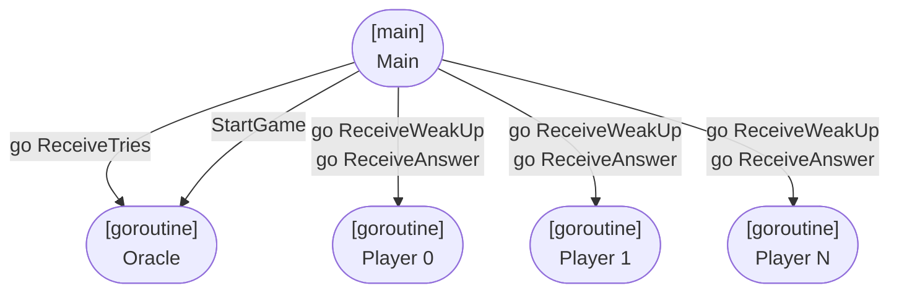
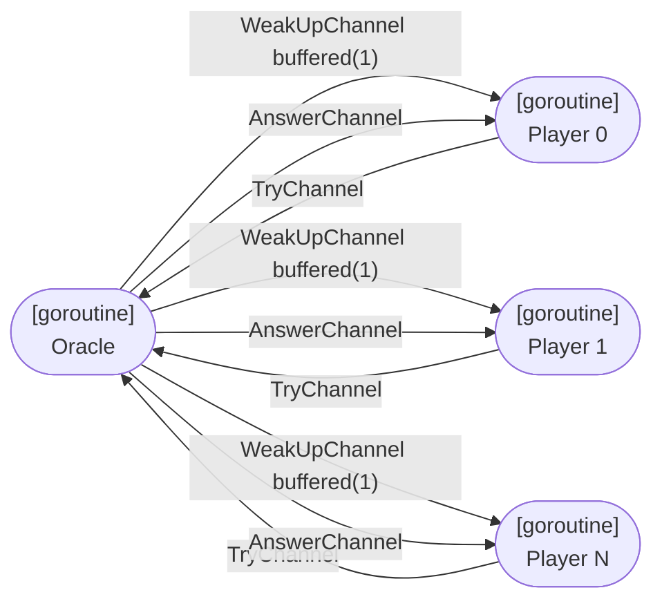
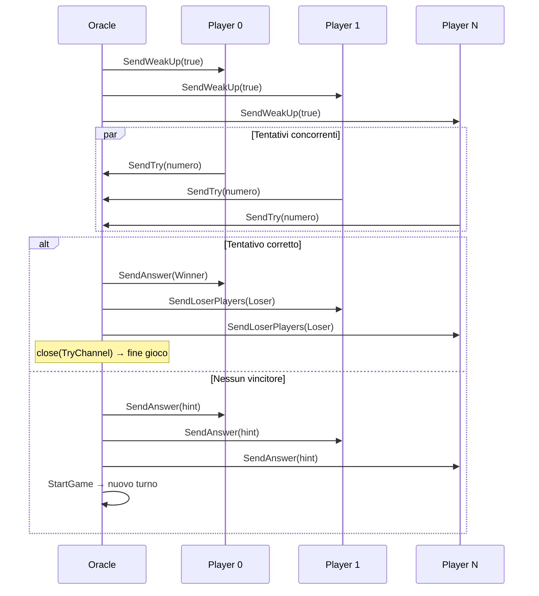
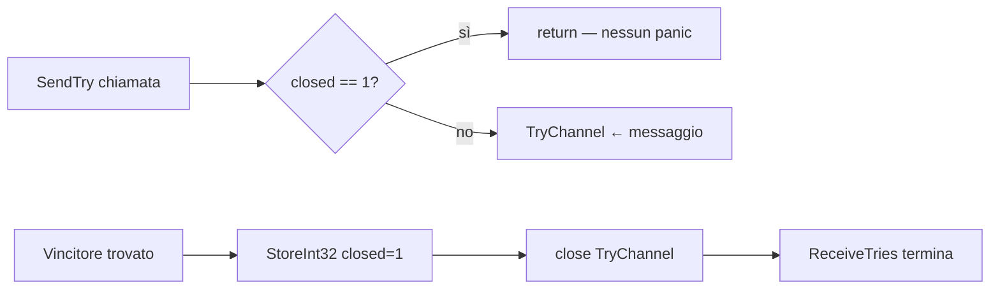
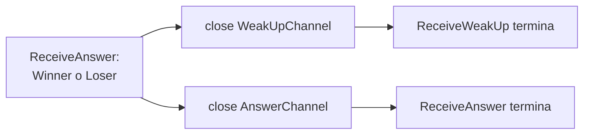
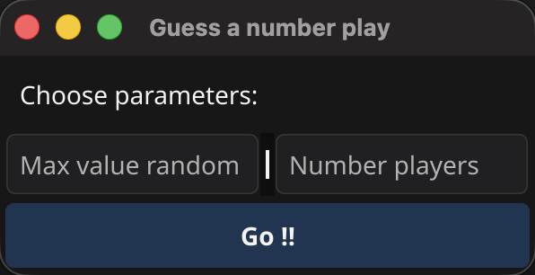
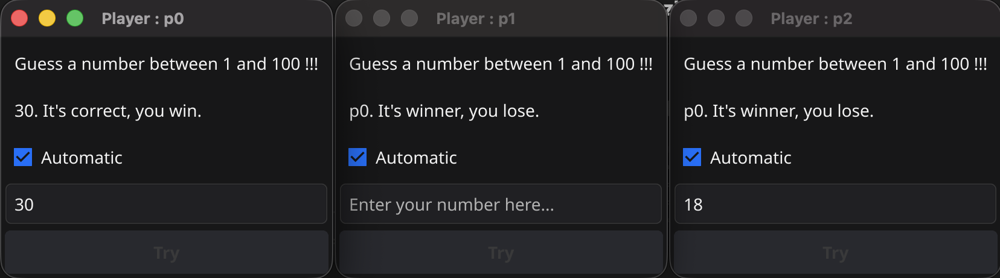

# Report – Guess The Number (Go)

---

## Indice

1. [Analisi del problema](#1-analisi-del-problema)
2. [Architettura proposta](#2-architettura-proposta)
3. [Gestione della concorrenza](#3-gestione-della-concorrenza)
4. [Sviluppo](#4-sviluppo)
5. [Risultati e considerazioni](#5-risultati-e-considerazioni)

---

## 1. Analisi del problema

Un **Oracolo** estrae un numero pseudocasuale in `[0, MAX]` e `N` giocatori tentano di indovinarlo. Le regole:

- A ogni turno ogni giocatore invia **esattamente un tentativo**.
- L'Oracolo notifica tutti contemporaneamente; l'ordine di arrivo è **non deterministico**.
- Se un tentativo è corretto: vittoria al vincitore, sconfitta agli altri — il gioco termina.
- Altrimenti: hint (troppo grande / troppo piccolo) e nuovo turno.
- Ogni giocatore può disattivare il bot e giocare manualmente.


| Requisito | Descrizione                                      |
| --------- | ------------------------------------------------ |
| **R1**    | N giocatori concorrenti                          |
| **R2**    | Ordine non deterministico per turno              |
| **R3**    | Un solo tentativo per giocatore per turno        |
| **R4**    | L'Oracolo scandisce i turni                      |
| **R5**    | Terminazione pulita senza panic su canali chiusi |

---

## 2. Architettura proposta

Il sistema usa due entità — **Oracle** e **Player** — che comunicano solo tramite **channel** Go, senza lock o mutex, seguendo il principio _"Do not communicate by sharing memory; share memory by communicating"_.

### 2.1 Architettura delle goroutine



### 2.2 Comunicazione tramite canali



### 2.3 Ciclo di un turno



---

## 3. Gestione della concorrenza

### 3.1 Non determinismo e un tentativo per turno (R2, R3)

`StartGame` mescola i giocatori con `Shuffle` prima di inviare i `WakeUp`. Poiché i giocatori sono goroutine
indipendenti, l'ordine di arrivo su `TryChannel` rimane non deterministico. Il `WeakUpChannel` è **buffered(1)** per
permettere a `SendWeakUp` di non bloccarsi mentre scorre la lista.

L'Oracolo conta i tentativi ricevuti e avvia il turno successivo solo quando tutti hanno risposto:

```go
countPlayerThatTried++
if countPlayerThatTried == len(startPlayers) {
    countPlayerThatTried = 0
    oracle.StartGame(startPlayers)
}
```

### 3.2 Terminazione pulita (R5)

Alla vittoria l'Oracolo chiude `TryChannel`, ma altre goroutine potrebbero ancora inviare su di esso causando un panic.
La soluzione è un **flag atomico** controllato prima di ogni send:



È fondamentale usare **pointer receiver** (`*OracleImpl`): con value receiver, `StoreInt32` agirebbe su una copia locale
e il flag non sarebbe mai visibile alle altre goroutine.

Alla ricezione di `Winner` / `Loser`, il Player chiude i propri canali terminando le sue goroutine:



---

## 4. Sviluppo

### 4.1 Interfacce principali

```go
type Oracle interface {
    SecretNumber() int
    StartGame(players []Player)
    SendTry(player Player, number int)
    ReceiveTries(players []Player)
}

type Player interface {
    Name() string
    UI() PlayerUI
    MindNumber(oracle Oracle)
    SendWeakUp(weakUp bool)
    ReceiveWeakUp(oracle Oracle)
    SendAnswer(try TryMessage, answer Answer)
    SendLoserPlayers(try TryMessage, answer Answer)
    ReceiveAnswer()
}
```

### 4.2 Strutture dati

```go
type OracleImpl struct {
    secretNumber   int
    MaxRandomValue int
    TryChannel     chan TryMessage
    closed         int32          // flag atomico
}

type PlayerImpl struct {
    name          string
    ui            PlayerUI
    WeakUpChannel chan WakeUpMessage  // buffered(1)
    AnswerChannel chan AnswerMessage
}
```

### 4.3 Interfaccia grafica

<div style="display: flex; gap: 2%; justify-content: center; ">
    
    
</div>

La GUI è realizzata con **Fyne**. Ogni Player ha una finestra con label di stato, campo numero, bottone Try e checkbox
bot. Tutte le modifiche UI avvengono tramite `fyne.Do(fun)` (`SafelyUICall`), obbligatorio per rispettare il thread
model di Fyne.

---

## 5. Risultati e considerazioni

Go si è dimostrato adatto per questo problema: goroutine e channel hanno permesso di sincronizzare le entità senza lock
espliciti, mantenendo il codice leggibile. I punti chiave emersi:

- **Pointer receiver**: obbligatorio per operazioni atomiche su strutture condivise tra goroutine.
- **Channel buffered**: evita deadlock nel broadcast di `WakeUp` (un solo slot per giocatore).
- **`range` su channel**: termina il loop automaticamente alla chiusura, semplificando la logica di fine gioco.
- **`fyne.Do`**: unico modo sicuro per aggiornare la UI da goroutine non-main.
