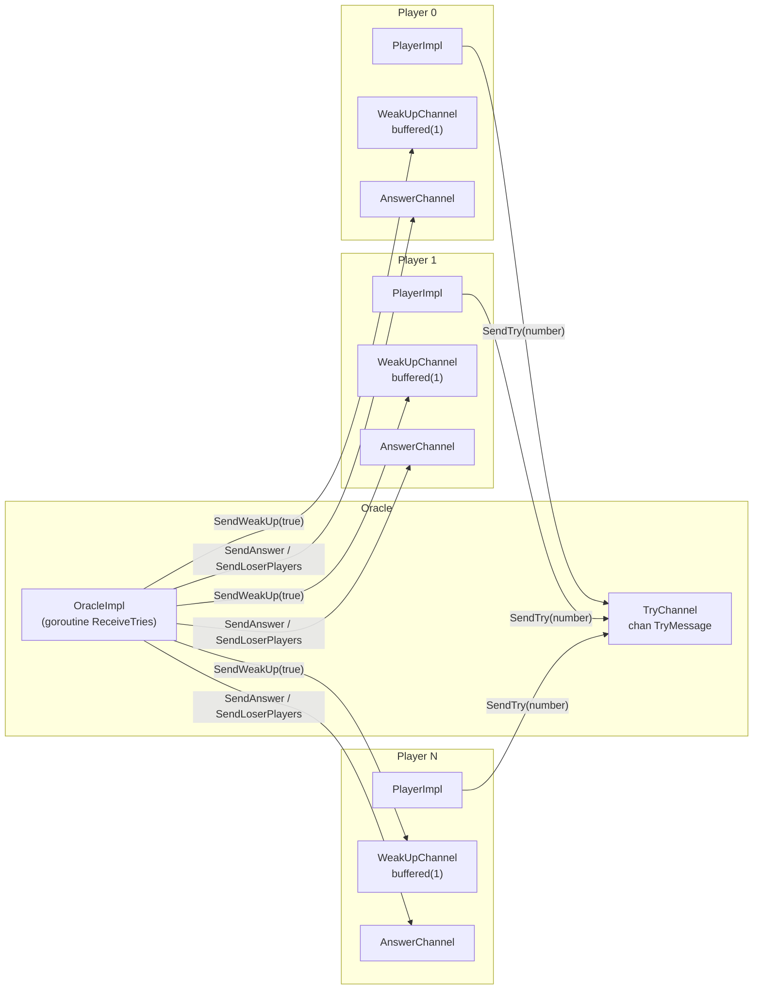
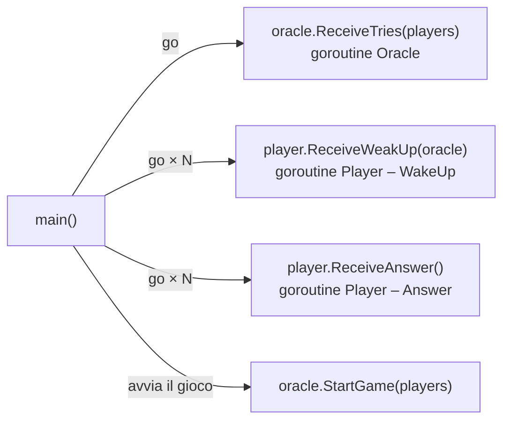
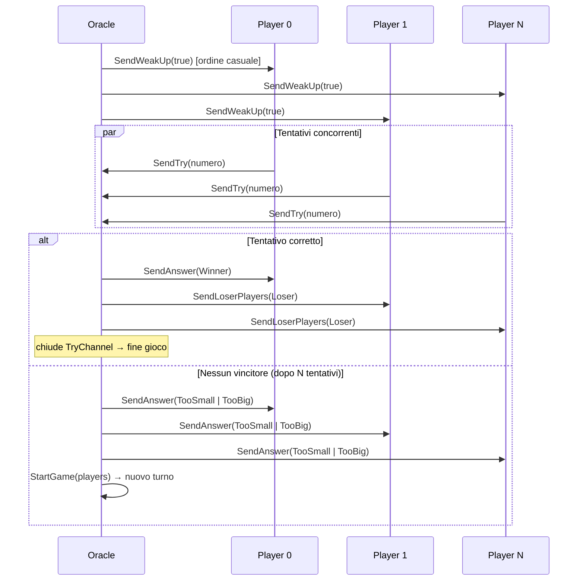
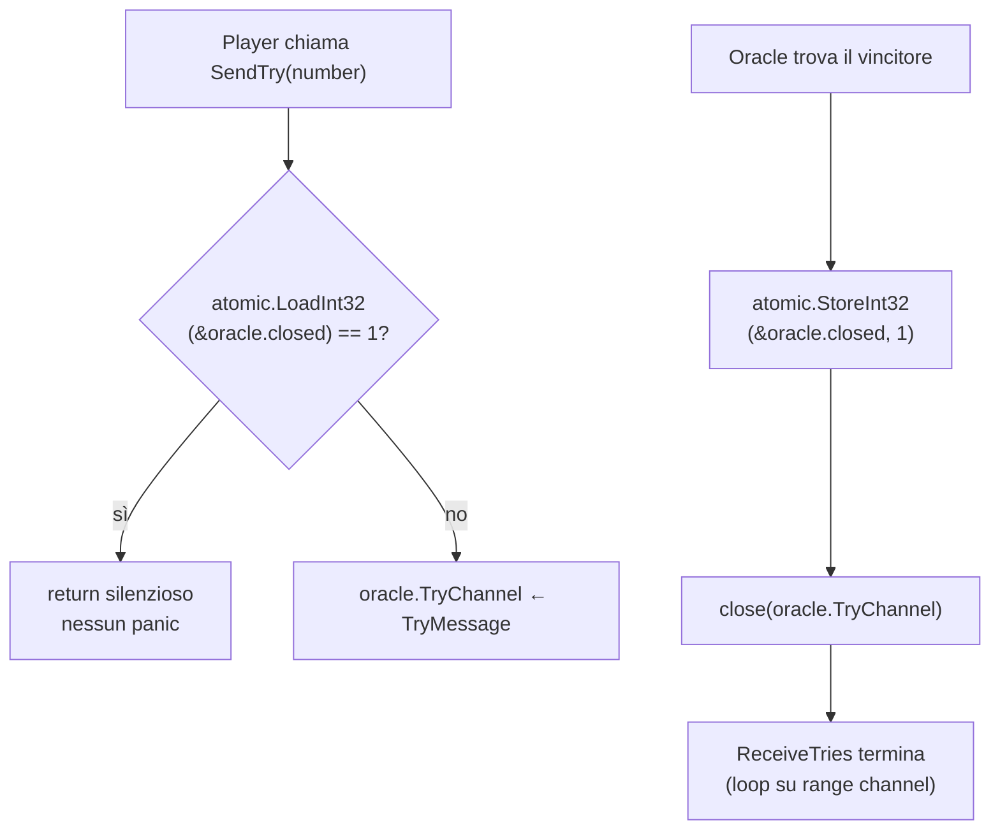
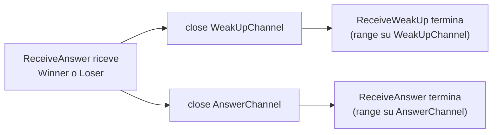

# Report – Guess The Number (Go)

---

## Indice

1. [Analisi del problema](#1-analisi-del-problema)
2. [Architettura proposta](#2-architettura-proposta)
3. [Gestione della concorrenza](#3-gestione-della-concorrenza)
4. [Sviluppo](#4-sviluppo)
5. [Risultati e considerazioni](#5-risultati-e-considerazioni)

---

## 1. Analisi del problema

Il sistema da realizzare simula il gioco **"Guess the Number"**, in cui un Oracolo estrae un numero pseudocasuale
nell'intervallo `[0, MAX]` e un insieme di `N` giocatori (bot) tenta di indovinarlo. Le regole del gioco sono:

- A ogni turno ogni giocatore invia **esattamente un tentativo**.
- L'ordine di invio è **non deterministico**: l'Oracolo notifica tutti i giocatori simultaneamente e raccoglie le
  proposte nell'ordine di arrivo.
- Se un tentativo coincide con il numero segreto, l'Oracolo invia un messaggio di **vittoria** al vincitore e di *
  *sconfitta** agli altri, terminando il gioco.
- Se nessun tentativo è corretto, l'Oracolo risponde con un **hint** (troppo grande / troppo piccolo) e avvia un nuovo
  turno.
- Qualsiasi giocatore può disattivare la modalità bot e giocare manualmente.

### Requisiti chiave

| Requisito | Descrizione                                                |
|-----------|------------------------------------------------------------|
| **R1**    | N giocatori concorrenti che inviano tentativi in parallelo |
| **R2**    | Ordine non deterministico dei tentativi per turno          |
| **R3**    | Un solo tentativo per giocatore per turno                  |
| **R4**    | L'Oracolo scandisce i turni notificando tutti i giocatori  |
| **R5**    | Terminazione pulita del gioco senza panic su canali chiusi |

---

## 2. Architettura proposta

Il sistema è modellato con due entità principali — **Oracle** e **Player** — che comunicano esclusivamente attraverso
**channel** Go. Non viene usato alcun lock o mutex: tutta la sincronizzazione avviene tramite scambio di messaggi,
seguendo il principio _"Do not communicate by sharing memory; share memory by communicating"_.

### 2.1 Entità e canali



### 2.2 Goroutine per entità

Per ogni entità vengono lanciate goroutine distinte, una per ciascun canale da ascoltare:



### 2.3 Ciclo di un turno



---

## 3. Gestione della concorrenza

### 3.1 Ordine non deterministico (R2 e R3)

Per garantire l'ordine non deterministico dei tentativi, `StartGame` mescola la lista dei giocatori con `Shuffle` prima
di inviare i `WakeUp`. Questo non fissa un ordine di arrivo, poiché i giocatori sono goroutine indipendenti che inviano
su `TryChannel` concorrentemente:

```go
func (oracle *OracleImpl) StartGame(players []Player) {
    Foreach(Shuffle(players), func (player Player) {
        player.SendWeakUp(true) // inviato nell'ordine casuale del Shuffle...
    })
    // ...ma i giocatori rispondono in parallelo → ordine di arrivo non deterministico
}
```

Il `WeakUpChannel` è **buffered(1)**: permette a `SendWeakUp` di non bloccarsi, così l'Oracolo notifica tutti i
giocatori senza aspettare che ciascuno abbia già letto il messaggio.

```go
playerImpl.WeakUpChannel = make(chan WakeUpMessage, 1) // buffered
```

### 3.2 Un tentativo per turno (R3)

L'Oracolo conta i tentativi ricevuti con `countPlayerThatTried`. Solo quando tutti i giocatori hanno inviato la loro
proposta viene avviato il turno successivo:

```go
countPlayerThatTried++
if countPlayerThatTried == len(startPlayers) {
countPlayerThatTried = 0
oracle.StartGame(startPlayers)  // nuovo turno
}
```

### 3.3 Terminazione pulita (R5)

Quando viene trovato un vincitore, l'Oracolo deve chiudere `TryChannel`. Il problema è che altre goroutine potrebbero
ancora stare per inviare su quel canale (causando un panic). La soluzione adotta un **flag atomico** controllato prima
di ogni send:



È fondamentale che `OracleImpl` usi **pointer receiver** (`*OracleImpl`): con un value receiver, `atomic.StoreInt32`
modificherebbe una copia locale e il flag non sarebbe mai visto dalle altre goroutine.

```go
// SBAGLIATO – value receiver: closed modificato su copia locale
func (oracle OracleImpl) ReceiveTries(...) { ... }

// CORRETTO – pointer receiver: closed modificato sull'istanza condivisa
func (oracle *OracleImpl) ReceiveTries(...) { ... }
```

La chiusura dei canali del Player segue lo stesso pattern: `ReceiveAnswer` chiude `WeakUpChannel` e `AnswerChannel` alla
ricezione di `Winner` o `Loser`, terminando entrambe le goroutine di ascolto in modo pulito.



---

## 4. Sviluppo

### 4.1 Oracle

```go
type Oracle interface {
SecretNumber() int
StartGame(players []Player)
SendTry(player Player, number int)
ReceiveTries(players []Player)
}

type OracleImpl struct {
secretNumber   int
MaxRandomValue int
TryChannel     chan TryMessage
closed         int32 // flag atomico per terminazione sicura
}
```

`ReceiveTries` esegue in una goroutine dedicata e itera sul `TryChannel` con `range`: quando il canale viene chiuso, il
loop termina automaticamente.

### 4.2 Player

```go
type Player interface {
Name() string
UI() PlayerUI
MindNumber(oracle Oracle)
SendWeakUp(weakUp bool)
ReceiveWeakUp(oracle Oracle)
SendAnswer(try TryMessage, answer Answer)
SendLoserPlayers(try TryMessage, answer Answer)
ReceiveAnswer()
}

type PlayerImpl struct {
name          string
ui            PlayerUI
WeakUpChannel chan WakeUpMessage // buffered(1)
AnswerChannel chan AnswerMessage
}
```

`MindNumber` simula il "pensiero" del bot con un'attesa casuale, poi invia il tentativo tramite `TryButton.OnTapped()`
nel contesto UI di Fyne (`SafelyUICall`). Se la modalità automatica è disattivata, l'utente può inserire il numero
manualmente.

### 4.3 Ciclo di vita delle goroutine

```mermaid
gantt
    title Ciclo di vita goroutine
    dateFormat X
    axisFormat %s

    section Oracle
        ReceiveTries: o1, 0, 10

    section Player 0
        ReceiveWeakUp: p0w, 0, 9
        ReceiveAnswer: p0a, 0, 9

    section Player 1
        ReceiveWeakUp: p1w, 0, 9
        ReceiveAnswer: p1a, 0, 9

    section Fine gioco
        Chiusura canali: milestone, 9, 10
```



### 4.4 Interfaccia grafica

<!-- TODO: inserire screenshot del menu e delle finestre dei giocatori -->

La GUI è realizzata con **Fyne**, un framework Go per interfacce grafiche cross-platform. Ogni Player ha una finestra
dedicata con:

- Label per lo stato corrente (hint o esito)
- Campo di testo per il numero
- Bottone "Try" (disabilitato durante l'attesa, abilitato a inizio turno)
- Checkbox per abilitare/disabilitare il bot automatico

Le chiamate alla GUI avvengono sempre tramite `fyne.Do(fun)` (`SafelyUICall`) per rispettare il thread model di Fyne,
che richiede che le modifiche UI avvengano nel goroutine principale.

---

## 5. Risultati e considerazioni

Il linguaggio Go si è dimostrato particolarmente adatto per questo tipo di problema: il modello di concorrenza basato su
goroutine e channel ha permesso di implementare la sincronizzazione tra le entità in modo pulito, senza ricorrere a lock
espliciti.

I principali aspetti appresi:

- **Pointer vs value receiver**: critico quando si usano operazioni atomiche o si condividono strutture tra goroutine.
- **Channel buffered**: indispensabile per evitare deadlock nel pattern di notifica broadcast (un solo slot garantisce
  che il mittente non si blocchi).
- **`range` su channel**: idioma Go per ricevere messaggi finché il canale non viene chiuso, semplificando la logica di
  terminazione.
- **`fyne.Do`**: necessario per tutte le modifiche UI da goroutine non-main.

Il sistema è facilmente scalabile: aggiungere nuovi giocatori richiede solo di estendere la lista `players` — la logica
dell'Oracolo e dei Player non cambia.
