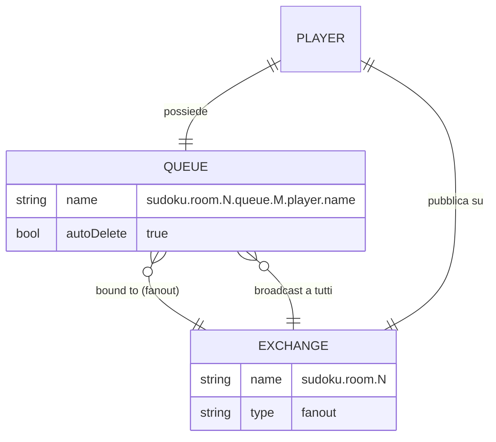
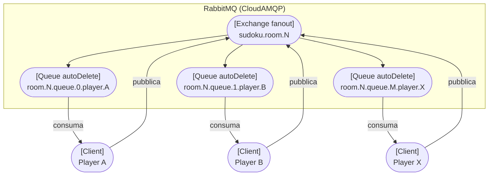
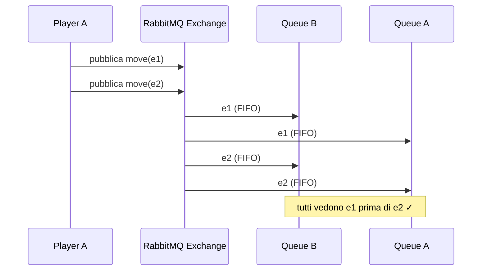
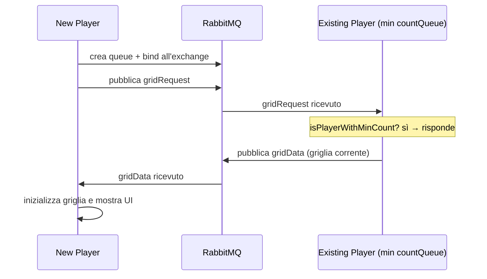
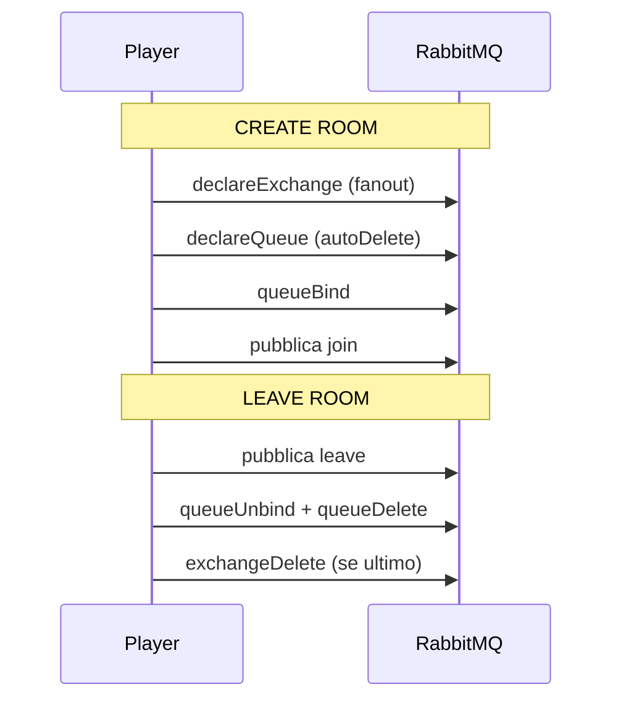
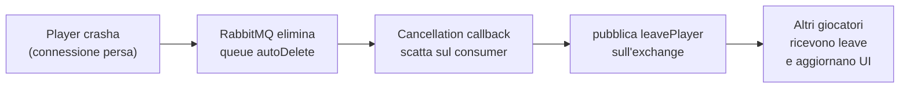
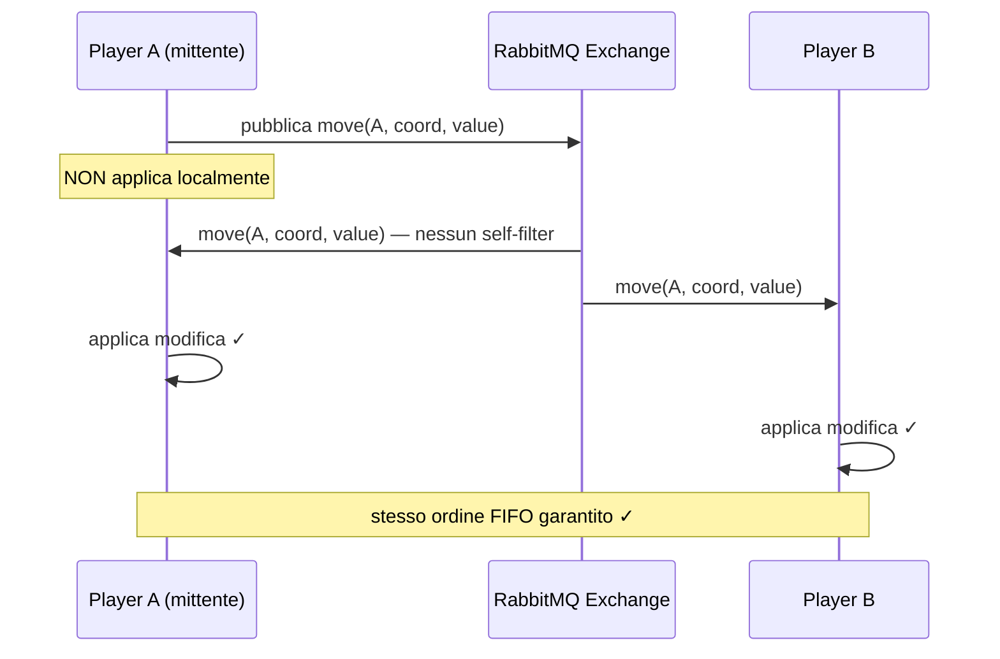
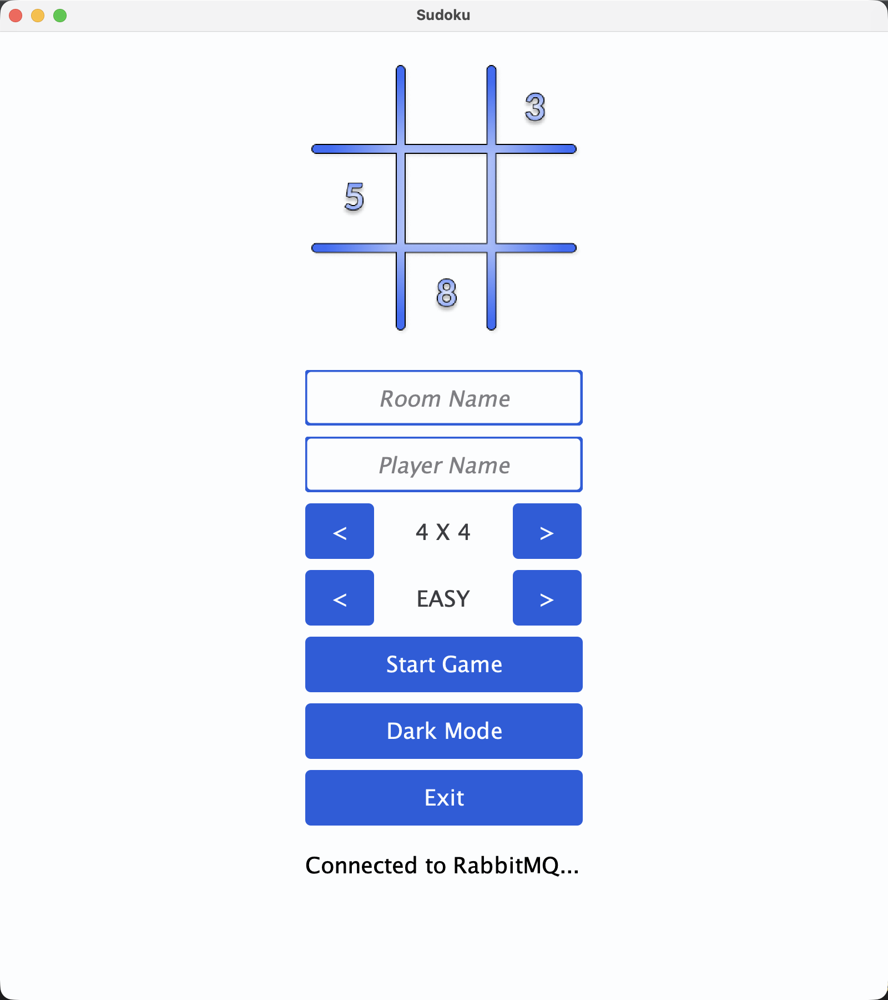
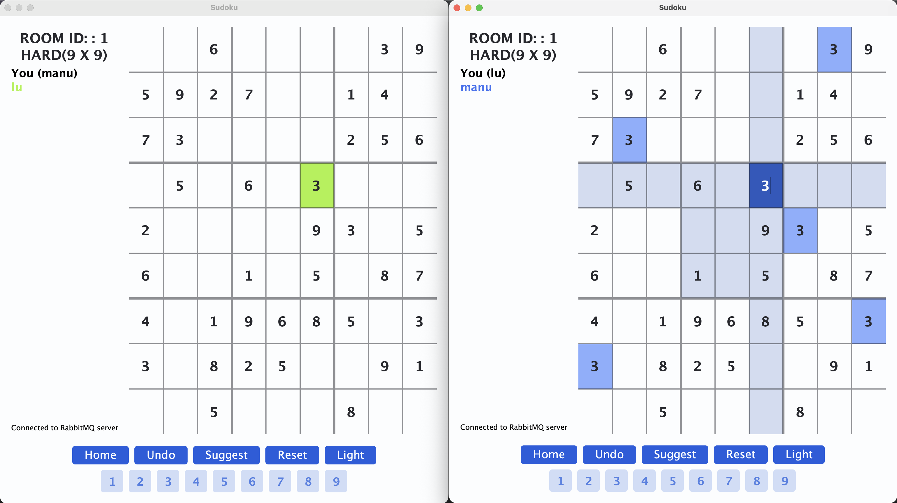

# Report – Sudoku MOM (RabbitMQ)

## Indice

1. [Analisi del problema](#1-analisi-del-problema)
2. [Architettura proposta](#2-architettura-proposta)
3. [Consistenza e sincronizzazione](#3-consistenza-e-sincronizzazione)
4. [Gestione degli eventi dinamici](#4-gestione-degli-eventi-dinamici)
5. [Sviluppo](#5-sviluppo)
6. [Risultati e considerazioni](#6-risultati-e-considerazioni)

---

## 1. Analisi del problema

Si vuole realizzare una versione distribuita cooperativa del Sudoku in cui più giocatori in rete collaborano sulla stessa griglia. Il sistema deve:

- Permettere la **creazione dinamica** di nuove griglie e la **partecipazione** a partite già avviate.
- Garantire che ogni giocatore veda in modo **consistente** lo stato della griglia e le caselle selezionate dagli altri: dati due eventi e1 ed e2, se e1 happened-before e2 per un giocatore, allora e1 happened-before e2 per qualsiasi altro giocatore.
- Supportare l'**uscita dinamica** di qualsiasi giocatore, incluso chi ha creato la partita, anche a causa di **crash**.

### Requisiti chiave


| Requisito | Descrizione                                                   |
|-----------|---------------------------------------------------------------|
| **R1**    | Creazione e join dinamico di stanze di gioco                  |
| **R2**    | Consistenza happened-before sugli eventi di modifica griglia  |
| **R3**    | Visibilità delle selezioni correnti degli altri giocatori     |
| **R4**    | Uscita/crash di qualsiasi giocatore senza bloccare la partita |
| **R5**    | Sincronizzazione della griglia al join di un nuovo giocatore  |

---

## 2. Architettura proposta

L'architettura è **decentralizzata**: non esiste un server centrale che coordina la partita.
La comunicazione avviene tramite **RabbitMQ** (ospitato su CloudAMQP), che funge da message broker.

### 2.1 Componenti RabbitMQ



- **Exchange** (fanout): uno per stanza, identificato dall'ID della partita. Ogni messaggio pubblicato viene inoltrato a **tutte** le code legate all'exchange.
- **Queue**: una per giocatore, con nome che codifica `roomId`, `countQueue` (indice progressivo) e `playerName`. Il flag `autoDelete: true` permette di rilevare i crash.

### 2.2 Architettura della stanza



Ogni client è sia **produttore** (pubblica sull'exchange) che **consumatore** (legge dalla propria queue).
Poiché l'exchange è fanout, un messaggio pubblicato da Player A arriva anche nella sua stessa queue: ogni client applica la modifica **solo alla ricezione**, garantendo consistenza globale.

### 2.3 Tipi di messaggio


| Messaggio     | Direzione | Scopo                               |
|---------------|-----------|-------------------------------------|
| `join`        | broadcast | Notifica ingresso nuovo giocatore   |
| `leave`       | broadcast | Notifica uscita volontaria          |
| `gridRequest` | broadcast | Richiesta griglia al join           |
| `gridData`    | broadcast | Risposta con griglia corrente       |
| `move`        | broadcast | Inserimento/modifica di una casella |
| `focusGained` | broadcast | Selezione di una casella            |
| `focusLost`   | broadcast | Deselezione di una casella          |

---

<hr class="print-page-break">

## 3. Consistenza e sincronizzazione

### 3.1 Happened-before tramite FIFO (R2)

La consistenza happened-before è garantita dalla natura FIFO del canale RabbitMQ: un exchange fanout consegna i messaggi alle code **nell'ordine in cui sono stati pubblicati**. Poiché tutti i client leggono dalla propria coda in ordine, se e1 è pubblicato prima di e2, tutti i client ricevono e applicano e1 prima di e2.



Ogni client, incluso il mittente, applica la modifica **solo alla ricezione** dal broker — mai direttamente. Questo elimina race condition locali e garantisce che tutti partano dallo stesso stato.

### 3.2 Sincronizzazione griglia al join (R5)



Solo il giocatore con il **countQueue minore** (`isPlayerWithMinCount`) risponde alla `gridRequest`, evitando risposte duplicate. Poiché il countQueue è codificato nel nome della queue, è ricavabile tramite la Management API di RabbitMQ (`RabbitMQDiscovery`).

---

## 4. Gestione degli eventi dinamici

### 4.1 Join e leave volontario (R1, R4)




<hr class="print-page-break">


### 4.2 Crash detection (R4)

Il flag `autoDelete: true` sulla queue fa sì che RabbitMQ la elimini automaticamente quando il consumatore si disconnette. La **cancellation callback** registrata sul consumer intercetta questo evento e pubblica un messaggio di `leave` per notificare gli altri giocatori:



Uno `ShutdownHook` JVM garantisce l'invio del `leave` anche in caso di chiusura forzata del processo.

### 4.3 Self-filtering

Poiché il fanout recapita i messaggi anche al mittente, ogni tipo di messaggio ha una strategia di filtering differente:


| Messaggio                   | Strategia                                                    | Motivazione                                                                                   |
|-----------------------------|--------------------------------------------------------------|-----------------------------------------------------------------------------------------------|
| `move`                      | **Nessun filter** — il mittente consuma il proprio messaggio | Garantisce happened-before: la modifica è applicata solo alla ricezione dal broker, mai prima |
| `focusGained` / `focusLost` | Self-filter — il mittente ignora il proprio                  | Il player non deve aggiornare la propria selezione nella propria UI                           |
| `join` / `leave`            | Self-filter — il mittente ignora il proprio                  | Il player non deve aggiungersi/rimuoversi dalla propria lista giocatori                       |
| `gridData`                  | Inverse filter — solo il richiedente processa                | La risposta contiene il nome del richiedente; gli altri ignorano                              |
| `gridRequest`               | Filter per`isPlayerWithMinCount`                             | Solo un giocatore risponde, evitando risposte duplicate                                       |

La mossa è il caso più critico: **non applicare self-filter** è la scelta che garantisce la consistenza. Se il mittente applicasse la modifica localmente prima dell'invio, potrebbe osservare uno stato diverso dagli altri in caso di mosse concorrenti. Applicandola solo alla ricezione dal broker, tutti i client — incluso il mittente — vedono le mosse nello stesso ordine FIFO:



---

## 5. Sviluppo

### 5.1 RabbitMQConnector

Interfaccia principale che astrae tutta la comunicazione con RabbitMQ:

```java
public interface RabbitMQConnector {
    void createRoom(Player player);
    void joinRoom(RabbitMQDiscovery discovery, Player player);
    void leaveRoom(RabbitMQDiscovery discovery, Player player);
    void sendGridRequest(RabbitMQDiscovery discovery, Player player);
    void sendMove(RabbitMQDiscovery discovery, Player player,
                  Coordinate coordinate, int value);
    void activeCallbackReceiveMessage(
            Player player, Grid grid,
            JoinPlayer joinPlayer, LeavePlayer leavePlayer,
            PlayerMove moveAction, CreationGrid initGrid,
            FocusGained focusGained, FocusLost focusLost);
}
```

### 5.2 RabbitMQDiscovery

Interroga la Management API di RabbitMQ per ottenere informazioni sullo stato delle stanze:

```java
public interface RabbitMQDiscovery {
    int countExchangeBinds(String roomName);
    List<String> queueNamesFromExchange(String roomName);
    boolean isPlayerWithMinCount(String roomName, String queue);
    int countMessageOnQueue(String queueName);
}
```

`isPlayerWithMinCount` è il metodo chiave per selezionare chi risponde alla `gridRequest`: restituisce `true` solo per il giocatore con il countQueue più basso tra quelli connessi.

### 5.3 Player

```java
public interface Player {
    Optional<String> room();
    Optional<String> queue();
    Optional<String> name();
    void computeToCreateRoom(String countRoom, String countQueue, String playerName);
    void computeToJoinRoom(String roomId, String countQueue, String playerName);
}
```

Il nome della queue segue il pattern `sudoku.room.{roomId}.queue.{countQueue}.player.{name}`, che codifica tutte le informazioni necessarie senza stato centralizzato.

> **Nota — `NumberFilter` e consistenza UI:** la UI non mostra il numero digitato nella cella
> finché il messaggio non torna dal broker. Il `NumberFilter` intercetta l'input dell'utente,
> chiama `onModifyCell` che ritorna `false` (non aggiorna localmente), e la cella viene
> aggiornata solo dalla callback di `acceptMove` alla ricezione del messaggio. In questo modo
> **modello e UI sono sempre allineati** e aggiornati insieme, solo dopo il round-trip.

---

## 6. Risultati e considerazioni

<div style="display: flex; gap: 2%; justify-content: center; ">
    
    
</div>

### Vantaggi dell'approccio MOM

- **Disaccoppiamento totale**: i client non si conoscono tra loro e non dipendono da nessun server applicativo. RabbitMQ è l'unico punto di contatto, rendendo il sistema resiliente all'uscita di qualsiasi giocatore, incluso chi ha creato la stanza.
- **Consistenza garantita dall'infrastruttura**: la garanzia FIFO del broker è sufficiente a implementare happened-before senza algoritmi distribuiti aggiuntivi (no vector clock, no consensus). La complessità di sincronizzazione è delegata a RabbitMQ.
- **Scalabilità**: aggiungere un nuovo giocatore richiede solo la creazione di una nuova queue e il bind all'exchange esistente. Nessuna modifica agli altri client.
- **Crash detection nativa**: `autoDelete` + cancellation callback eliminano la necessità di heartbeat espliciti — RabbitMQ gestisce la disconnessione automaticamente.

### Svantaggi dell'approccio MOM

- **Latenza del round-trip**: ogni mossa richiede un round-trip verso il broker prima di essere visibile nella UI. In condizioni di rete lenta questo è percepibile dall'utente.
- **Dipendenza dal broker**: RabbitMQ è un single point of failure. Se il broker va giù, nessun client può comunicare, anche se sono sulla stessa rete locale.
