# Report – Sudoku Java RMI

## Indice

1. [Analisi del problema](#1-analisi-del-problema)
2. [Architettura proposta](#2-architettura-proposta)
3. [Consistenza e sincronizzazione](#3-consistenza-e-sincronizzazione)
4. [Gestione degli eventi dinamici](#4-gestione-degli-eventi-dinamici)
5. [Sviluppo](#5-sviluppo)
6. [Risultati e considerazioni](#6-risultati-e-considerazioni)

---

## 1. Analisi del problema

Il problema è lo stesso della Part 2A — Sudoku cooperativo distribuito — ma la soluzione adotta un approccio **centralizzato** basato su **Java RMI** (Distributed Object Computing).
Grazie a RMI, oggetti Java residenti su macchine diverse comunicano come se fossero locali, con la gestione della serializzazione e del trasporto trasparente per il programmatore.

Il sistema deve:

- Permettere la **creazione e il join dinamico** di stanze di gioco.
- Garantire che tutti i giocatori vedano la griglia in modo **consistente** (happened-before).
- Mostrare in tempo reale le **selezioni** delle caselle degli altri giocatori.
- Gestire l'**uscita/crash** di qualsiasi giocatore, incluso chi ha creato la stanza.

### Requisiti chiave

| Requisito | Descrizione                                                    |
|-----------|----------------------------------------------------------------|
| **R1**    | Creazione e join dinamico di stanze di gioco                   |
| **R2**    | Consistenza happened-before sugli eventi di modifica griglia   |
| **R3**    | Visibilità delle selezioni correnti degli altri giocatori      |
| **R4**    | Uscita/crash di qualsiasi giocatore senza bloccare la partita  |
| **R5**    | Architettura centralizzata (consentita dalla consegna per RMI) |

---

## 2. Architettura proposta

L'architettura è **centralizzata**: un `SudokuServer` remoto gestisce tutte le stanze attive e coordina le interazioni tra i client. Ogni client è a sua volta un oggetto remoto(`SudokuClient`), permettendo al server di notificarli via **callback**.

### 2.1 Componenti del sistema

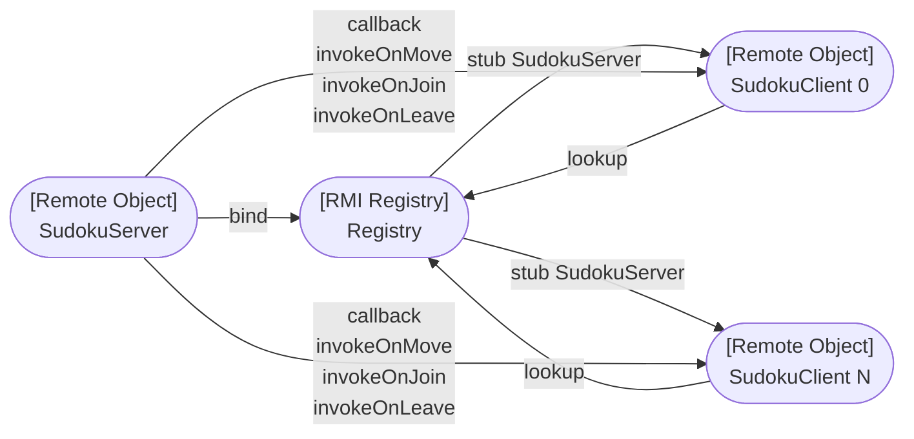

- **SudokuServer**: oggetto remoto centralizzato che gestisce le stanze. Mantiene una `ConcurrentHashMap<Integer, Room>` con un `ReentrantLock` per stanza.
- **SudokuClient**: ogni client è un oggetto remoto che espone metodi di callback invocati dal server per notificare aggiornamenti.
- **RMI Registry**: punto di lookup per ottenere lo stub del server.

### 2.2 Struttura di una stanza

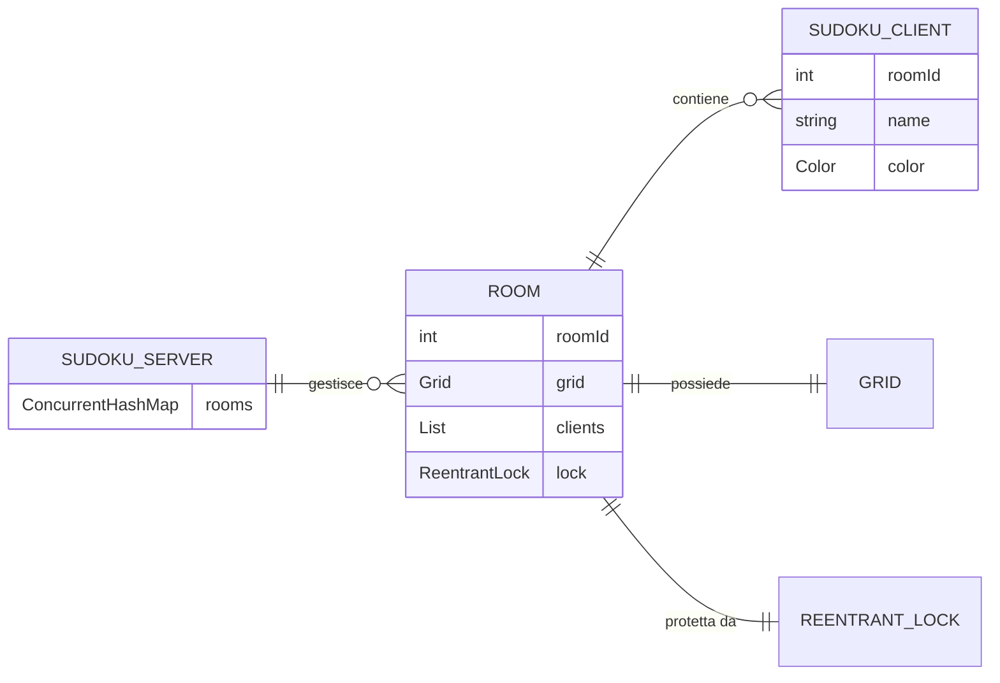

### 2.3 Tipi di callback server → client

| Callback              | Scopo                                                |
|-----------------------|------------------------------------------------------|
| `invokeOnEnter`       | Invia griglia e soluzione al nuovo giocatore         |
| `invokeOnMove`        | Notifica inserimento/modifica di una casella         |
| `invokeOnJoin`        | Invia lista giocatori correnti al nuovo arrivato     |
| `invokeOnJoinPlayer`  | Notifica agli altri l'ingresso di un nuovo giocatore |
| `invokeOnLeavePlayer` | Notifica l'uscita di un giocatore                    |
| `invokeOnFocusGained` | Notifica la selezione di una casella                 |
| `invokeOnFocusLost`   | Notifica la deselezione di una casella               |

---

## 3. Consistenza e sincronizzazione

### 3.1 ReentrantLock per stanza (R2)

La consistenza è garantita da un `ReentrantLock` per ogni stanza: tutte le operazioni che modificano la griglia o la lista dei giocatori acquisiscono il lock prima di procedere.
Questo serializza gli aggiornamenti, garantendo happened-before per tutti i client.

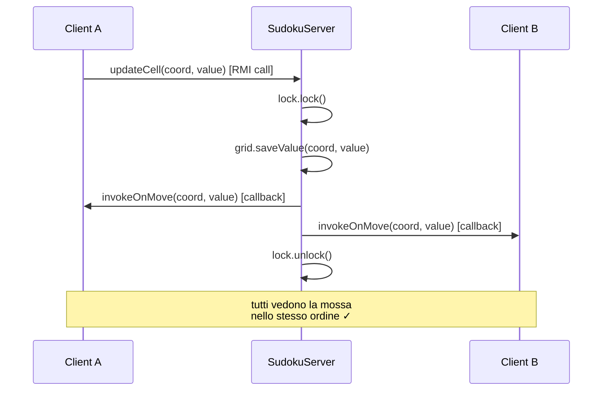

Poiché il server notifica tutti i client **dentro il lock**, è impossibile che due client vedano le mosse in ordine diverso: il lock serializza sia la modifica che le notifiche.


<hr class="print-page-break">


### 3.2 cantDoAction dentro il lock

La verifica delle precondizioni (es. casella già occupata, giocatore non autorizzato) avviene **dentro il lock** per evitare race condition di tipo check-and-act:

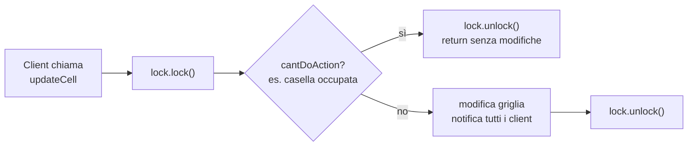

Se `cantDoAction` fosse verificato fuori dal lock, un altro thread potrebbe modificare la griglia tra il check e l'act, causando inconsistenze.

---

## 4. Gestione degli eventi dinamici

### 4.1 Create, Join e leave volontario (R1, R4)
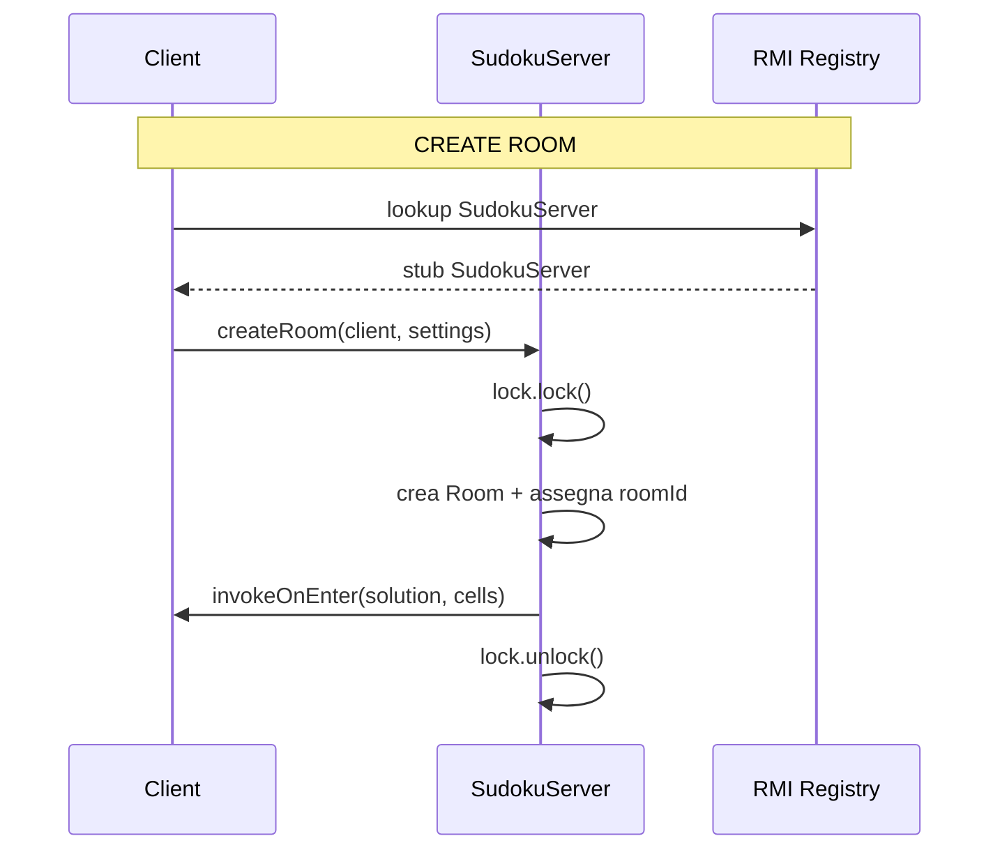


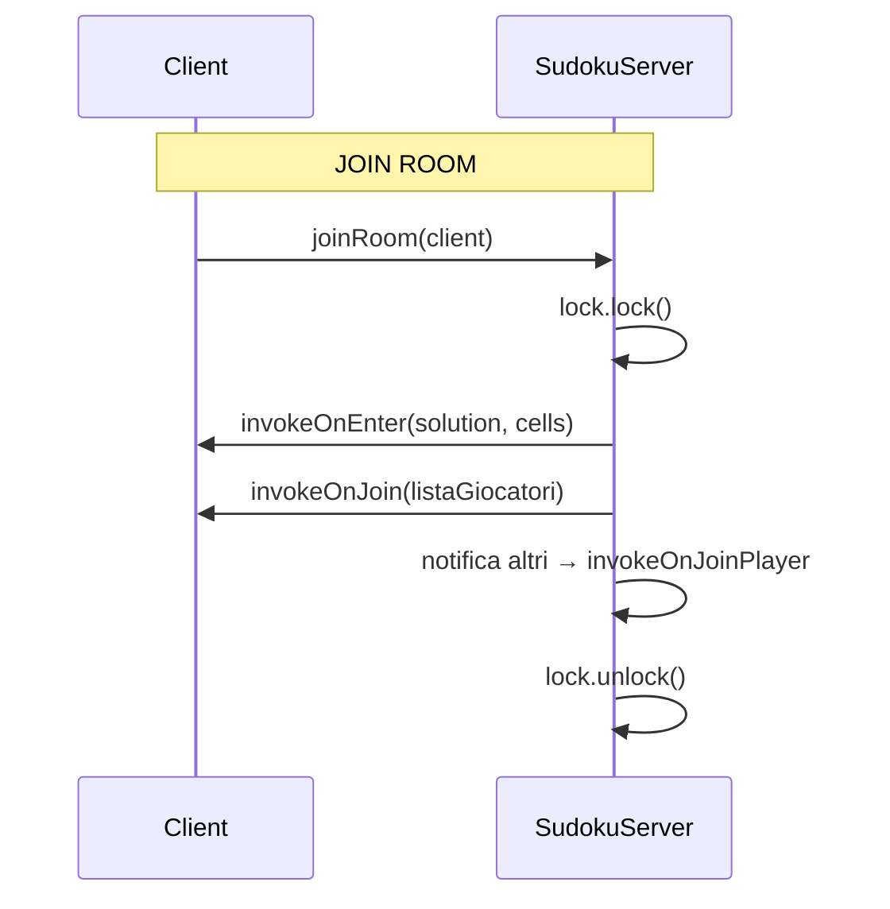


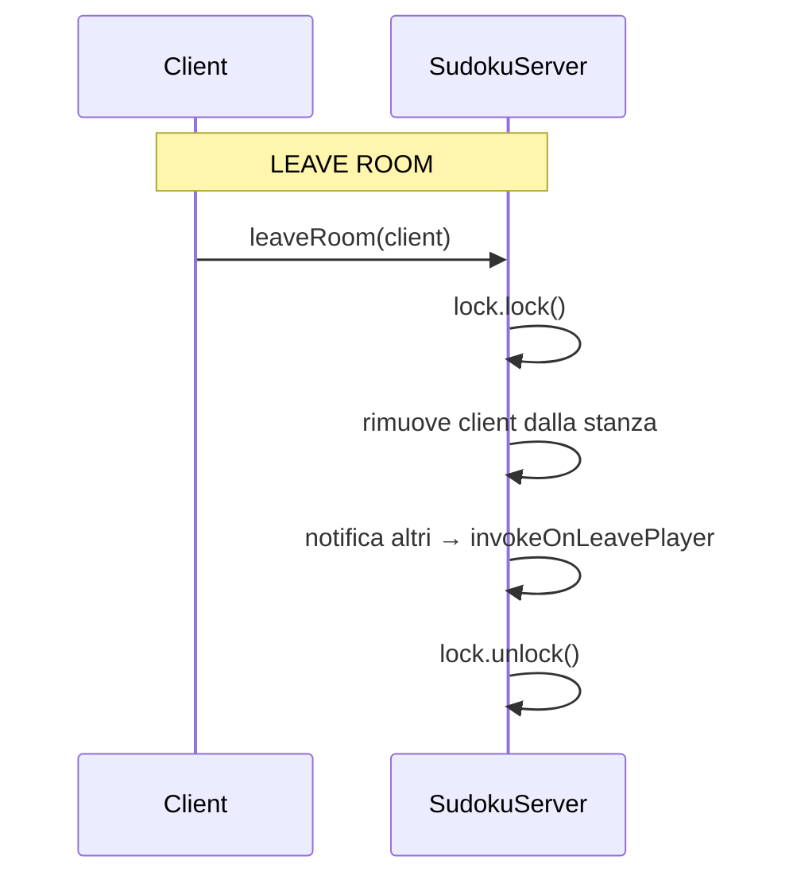

### 4.2 Crash detection — notifyOrRemove (R4)

Quando il server tenta una callback su un client crashato, RMI lancia una `RemoteException`.
Il metodo `notifyOrRemove` intercetta questa eccezione e rimuove il client dalla stanza, notificando gli altri giocatori:

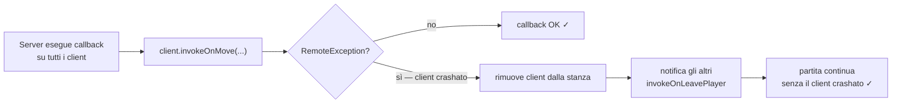

```java
private void notifyOrRemove(final List<SudokuClient> clients,
                            final Consumer<SudokuClient> action) {
  clients.removeIf(client -> {
    try {
      action.accept(client);
      return false; // client OK, non rimuovere
    } catch (RemoteException e) {
      return true;  // client morto, rimuovilo
    }
  });
}
```

### 4.3 JoinResult — gestione errori al join

Per gestire i casi di errore al join (stanza non trovata, nome già in uso) è stato definito un enum `JoinResult` che permette messaggi di errore precisi all'utente:

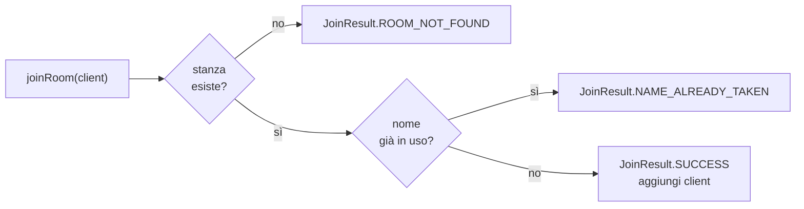

---

## 5. Sviluppo

### 5.1 SudokuServer

```java
public interface SudokuServer extends Serializable, Remote {
  JoinResult createRoom(SudokuClient client, Settings settings)
          throws RemoteException;
  JoinResult joinRoom(SudokuClient client) throws RemoteException;
  void leaveRoom(SudokuClient client) throws RemoteException;
  void updateCell(SudokuClient client, Coordinate coordinate, int value)
          throws RemoteException;
  void focusGained(SudokuClient client, Coordinate coordinate)
          throws RemoteException;
  void focusLost(SudokuClient client, Coordinate coordinate)
          throws RemoteException;
  byte[][] solution(SudokuClient client) throws RemoteException;
  byte[][] grid(SudokuClient client) throws RemoteException;
}
```

### 5.2 SudokuClient

```java
public interface SudokuClient extends Serializable, Remote {
  int roomId() throws RemoteException;
  String name() throws RemoteException;
  void setRoomId(int roomId) throws RemoteException;
  void invokeOnEnter(byte[][] solution, byte[][] cells) throws RemoteException;
  void invokeOnMove(Coordinate coordinate, int value) throws RemoteException;
  void invokeOnJoin(List<String> players) throws RemoteException;
  void invokeOnJoinPlayer(String player, Color color) throws RemoteException;
  void invokeOnLeavePlayer(String player) throws RemoteException;
  void invokeOnFocusGained(String player, Color color, Coordinate coordinate)
          throws RemoteException;
  void invokeOnFocusLost(String player, Coordinate coordinate)
          throws RemoteException;
}
```

### 5.3 ClientDatas

`ClientDatas` è un record serializzabile che il server usa per identificare un client senza mantenere un riferimento diretto all'oggetto remoto durante la serializzazione:

```java
public record ClientDatas(int roomId, String name, Color color)
        implements Serializable { }
```

### 5.4 Interfaccia grafica

<div style="display: flex; gap: 2%; justify-content: center; ">
    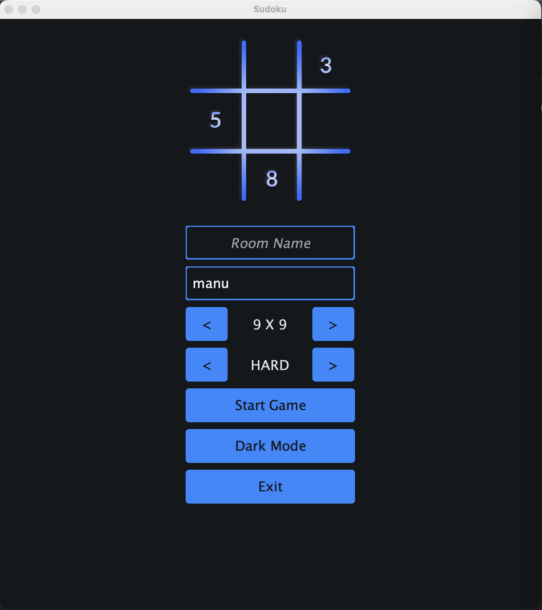
    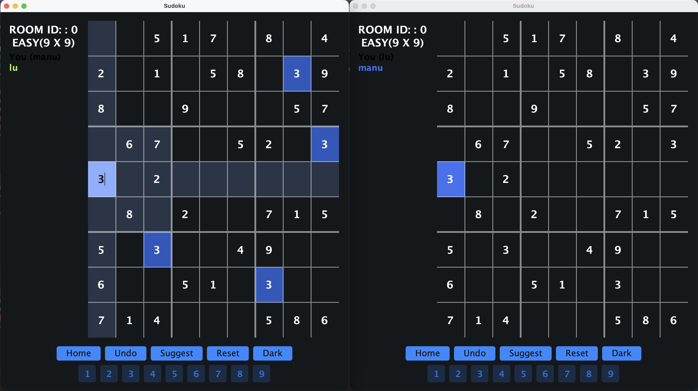
</div>

La GUI usa `JTextPane` con `StyledDocument` per mostrare i messaggi di gioco con il colore specifico di ogni giocatore. Il colore viene assegnato dal server al join(`setColor` chiamato prima della serializzazione di `ClientDatas`) e propagato a tutti i client tramite `invokeOnJoinPlayer`.

---

## 6. Risultati e considerazioni

### Vantaggi dell'approccio RMI centralizzato

- **Consistenza semplice**: il `ReentrantLock` per stanza serializza tutti gli accessi — nessun algoritmo distribuito necessario. La complessità di sincronizzazione è tutta nel server.
- **Crash detection nativa**: `RemoteException` segnala automaticamente la disconnessione di un client — nessuna infrastruttura aggiuntiva (no heartbeat, no autoDelete).
- **Trasparenza RMI**: le chiamate remote appaiono come chiamate locali, semplificando lo sviluppo rispetto a protocolli di messaggistica espliciti.
- **Callback bidirezionale**: il server può notificare i client attivamente senza polling, grazie al fatto che ogni client è a sua volta un oggetto remoto.

### Svantaggi dell'approccio RMI centralizzato

- **Single point of failure**: se il server va giù, tutte le partite attive sono perse.
  Nell'approccio MOM, il broker è l'unico punto critico ma gestisce la persistenza dei messaggi; qui la griglia esiste solo in memoria sul server.
- **Scalabilità limitata**: il lock per stanza serializza le operazioni — con molti giocatori nella stessa stanza, le callback sequenziali aumentano la latenza percepita.

### Confronto con Part 2A (MOM)

| Aspetto                 | RMI (centralizzato)      | MOM (decentralizzato)                 |
|-------------------------|--------------------------|---------------------------------------|
| Consistenza             | ReentrantLock sul server | FIFO fanout exchange                  |
| Crash detection         | RemoteException          | autoDelete + cancellation callback    |
| Single point of failure | Server applicativo       | Broker RabbitMQ                       |
| Complessità             | Bassa (lock + callback)  | Media (self-filter, gridRequest)      |
| Scalabilità             | Limitata dal lock        | Migliore (broker gestisce il routing) |