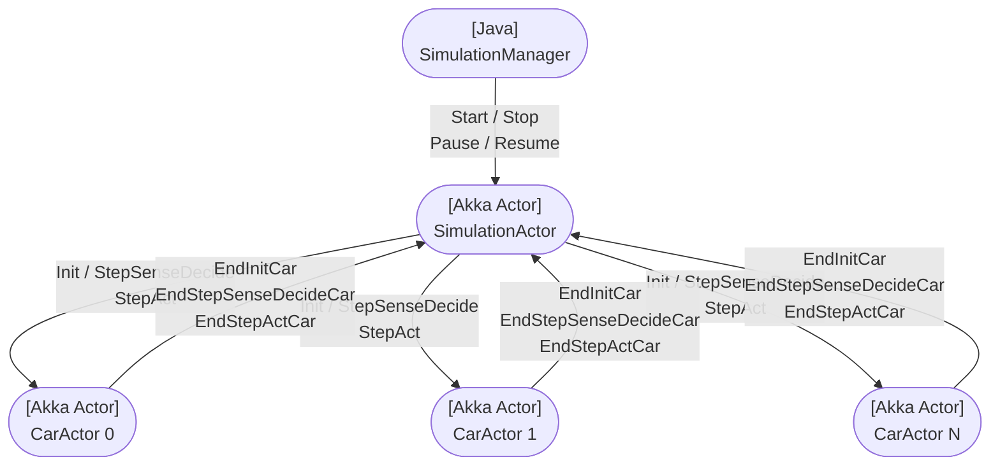
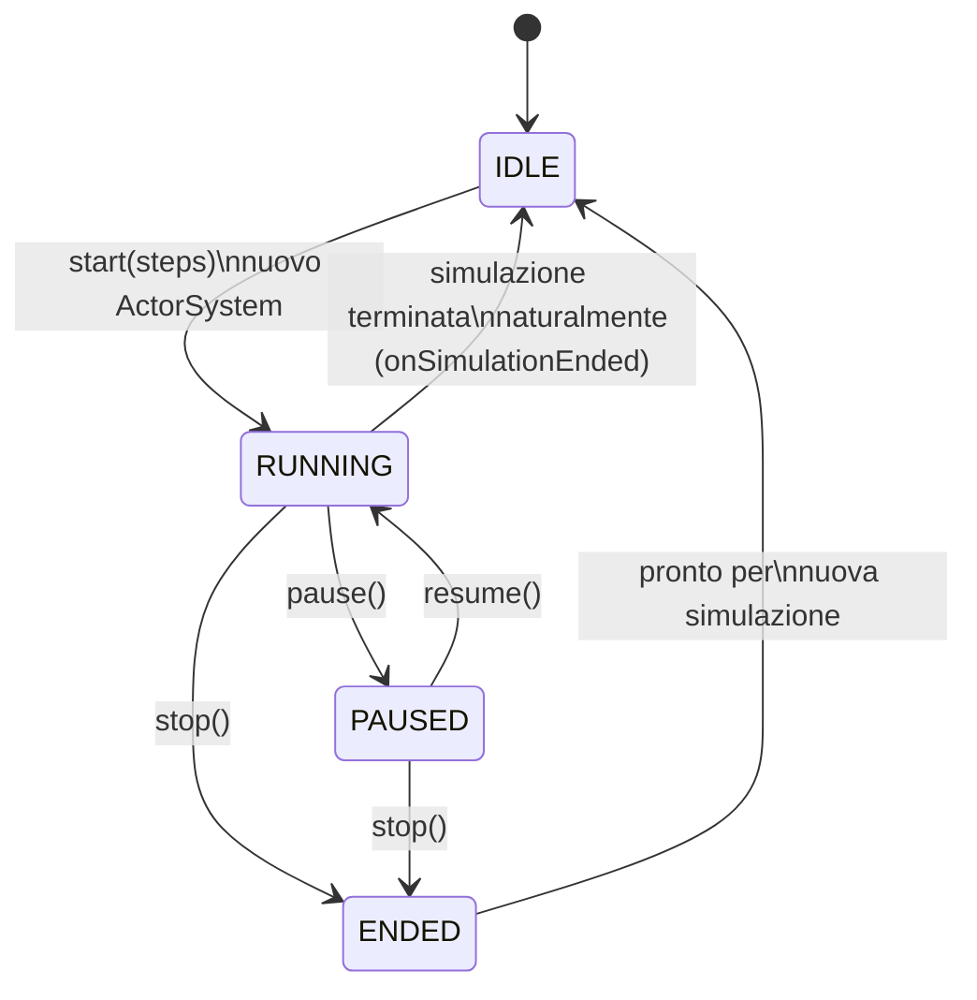
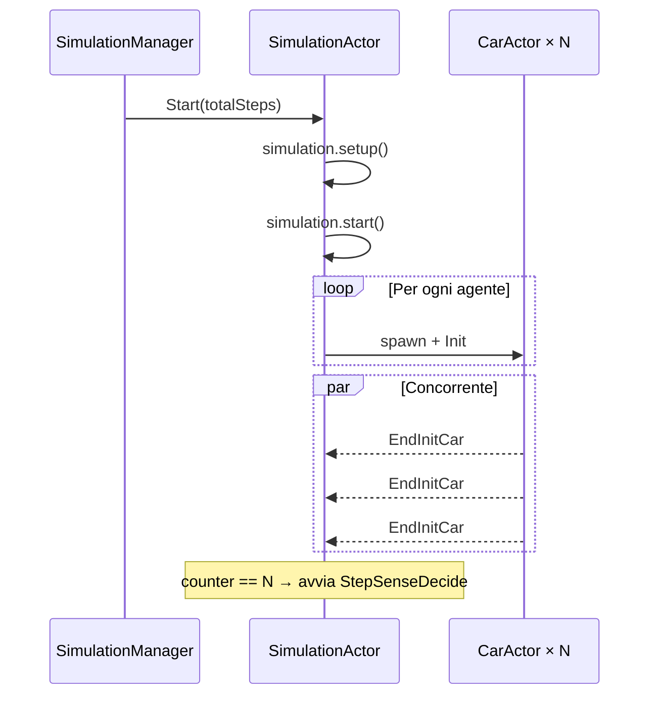
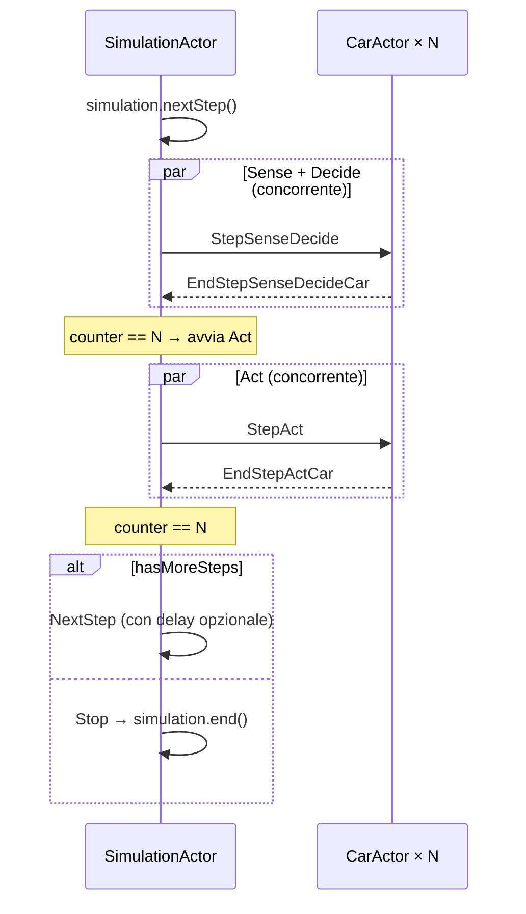
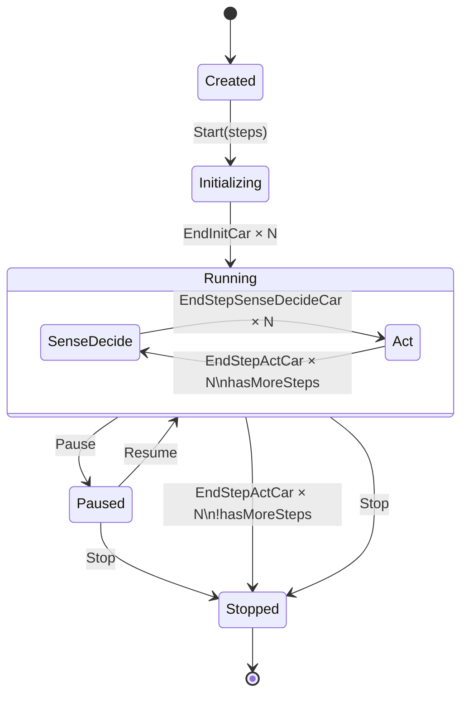
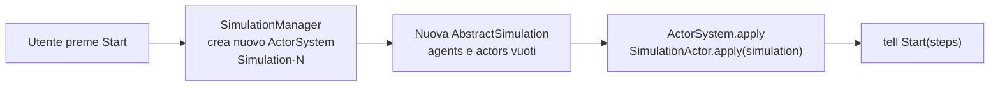
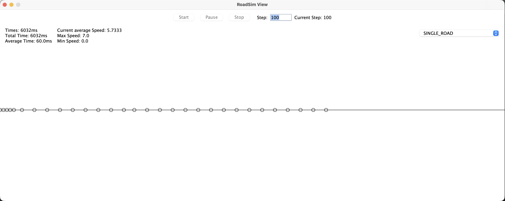
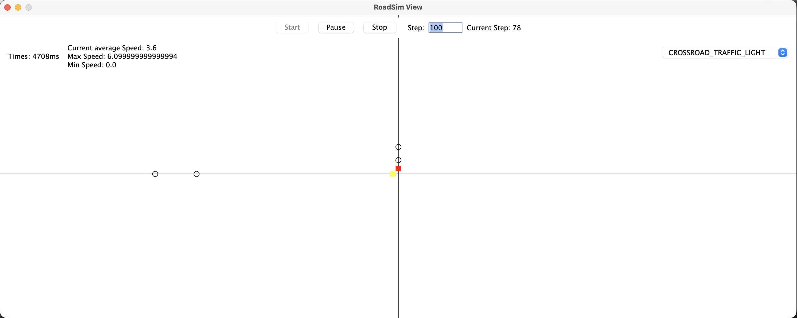

# Report Part 1 – Cars Simulation (Akka)

---

## Indice

1. [Analisi del problema](#1-analisi-del-problema)
2. [Architettura proposta](#2-architettura-proposta)
3. [Comportamento del sistema](#3-comportamento-del-sistema)
4. [Sviluppo](#4-sviluppo)
5. [Risultati e considerazioni](#5-risultati-e-considerazioni)

---

## 1. Analisi del problema

Il progetto riprende la simulazione agent-based di traffico dell'Assignment 1 e la riscrive adottando il
**paradigma ad attori** tramite il framework **Akka** (Scala). Ogni automobile diventa un attore autonomo che
gestisce il proprio stato e comunica esclusivamente tramite scambio di messaggi asincroni.

La simulazione procede a passi discreti di durata Δt. A ogni step le automobili eseguono le tre fasi
del proprio comportamento:

- **Sense** — lettura delle percezioni dall'ambiente (auto vicine, semafori)
- **Decide** — scelta dell'azione in base allo stato corrente e alle percezioni
- **Act** — esecuzione dell'azione sull'ambiente (avanzamento)

Le fasi Sense e Decide accedono all'ambiente **in sola lettura**; la scrittura avviene solo nella fase Act.
Lo step successivo può iniziare solo quando **tutte** le automobili hanno completato lo step corrente.

### Requisiti chiave

| Requisito | Descrizione |
|-----------|-------------|
| **R1** | Ogni automobile esegue Sense/Decide/Act in modo concorrente |
| **R2** | Lo step N+1 inizia solo dopo che tutte le auto hanno completato lo step N |
| **R3** | La simulazione supporta Start, Pause, Resume e Stop dalla GUI |
| **R4** | È possibile specificare il numero totale di step da eseguire |
| **R5** | Riavvio della simulazione senza conflitti tra ActorSystem |

---

## 2. Architettura proposta

### 2.1 Attori del sistema



- **SimulationManager** (Java) — gestisce il ciclo di vita dell'ActorSystem e i comandi della GUI.
- **SimulationActor** (Scala/Akka) — orchestra tutti gli step: invia messaggi ai CarActor e aspetta
  le risposte di tutti prima di procedere.
- **CarActor** (Scala/Akka) — un attore per ogni automobile; esegue le tre fasi e notifica il completamento.

### 2.2 Ciclo di vita di SimulationManager



Ad ogni `start()` viene creato un nuovo `ActorSystem` con nome univoco (`Simulation-N`), garantendo
l'assenza di conflitti tra esecuzioni successive.

---

## 3. Comportamento del sistema

### 3.1 Fase di inizializzazione



### 3.2 Esecuzione di uno step



Il pattern **counter** è il meccanismo di sincronizzazione centrale: `SimulationActor` incrementa un
contatore a ogni risposta ricevuta e procede alla fase successiva solo quando `counter == N`.

### 3.3 Comportamento di SimulationActor (DFA)



Il flag `started` in `SimulationActor` impedisce la doppia elaborazione del messaggio `Start` nel caso
in cui arrivi più di una volta sullo stesso attore.

---

## 4. Sviluppo

### 4.1 Messaggi degli attori

```scala 3
// SimulationActor — messaggi accettati
object SimulationActor:
    sealed trait Command
    case class Start(totalStep: Int) extends Command
    object Stop    extends Command
    object Pause   extends Command
    object Resume  extends Command
    private object NextStep extends Command
    object EndInitCar extends Command
    case class EndStepSenseDecideCar(carAgent: CarAgent) extends Command
    case class EndStepActCar(carAgent: CarAgent)         extends Command

// CarActor — messaggi accettati
object CarActor:
    sealed trait Command
    case class Init(actor: ActorRef[SimulationActor.Command],
                    simulation: AbstractSimulation) extends Command
    case class StepSenseDecide(actor: ActorRef[SimulationActor.Command],
                               simulation: AbstractSimulation) extends Command
    case class StepAct(actor: ActorRef[SimulationActor.Command],
                       simulation: AbstractSimulation) extends Command
```

### 4.2 Engine funzionale

`Engine` gestisce il tempo e gli step della simulazione secondo il **paradigma funzionale**: ogni operazione
restituisce una nuova istanza immutabile, eliminando lo stato condiviso mutabile.

```scala 3
trait Engine extends Scheduler, Stepper:
    val isInPause: Boolean
    def start(): Engine
    def pause(): Engine
    def resume(): Engine
    def stop(): Engine
    def nextStep(): Engine
    def setTotalSteps(value: Int): Engine
    def averageTimeForStep(): Double
    def computeDelay(): Option[Long]   // per sincronizzazione con tempo reale
```

`computeDelay()` restituisce il delay da attendere prima del prossimo step, permettendo di
sincronizzare la simulazione con il tempo reale (analogo al frame rate nei videogiochi).

### 4.3 Gestione riavvio (R5)



`SimulationType.getSimulation()` restituisce sempre una **nuova istanza** della simulazione: la lista
`agents` parte vuota, `setup()` la popola, evitando l'accumulo di agenti tra un'esecuzione e l'altra.

### 4.4 Interfaccia grafica

<div style="display: flex; gap: 2%; justify-content: center; ">
    
    
</div>

La GUI (Java Swing) espone i controlli Start, Pause/Resume, Stop e un campo per il numero di step.
`SimulationView` implementa `ViewSimulationListener` e riceve notifiche da `AbstractSimulation`
(`notifyInit`, `notifyStepDone`, `notifyEnd`). Tutti gli aggiornamenti UI avvengono tramite
`SwingUtilities.invokeLater` per rispettare il thread model di Swing.

---

## 5. Risultati e considerazioni

Il framework Akka ha permesso di modellare la simulazione in modo naturale: ogni automobile è un
attore indipendente che esegue le proprie fasi concorrentemente con le altre, senza condivisione di
stato mutabile.

Punti chiave emersi:

- **Pattern counter**: meccanismo semplice ed efficace per implementare la barriera di sincronizzazione
  tra step senza usare lock o monitor.
- **SimulationType come factory**: restituire una nuova istanza a ogni chiamata di `getSimulation()`
  è stato cruciale per evitare l'accumulo di agenti tra esecuzioni successive.
- **Behaviors.stopped**: terminare l'attore dopo `Stop` impedisce la ricezione di messaggi residui
  (es. `EndStepActCar` in arrivo tardivo) che potrebbero alterare lo stato post-terminazione.
- **Engine funzionale**: l'immutabilità dell'Engine elimina race condition sul tempo e sugli step,
  rendendo il codice più prevedibile e testabile.

Sono stati testati tutti e tre gli ambienti forniti nell'Assignment 1: singola strada senza semafori,
singola strada con semaforo, e incrocio con due semafori.